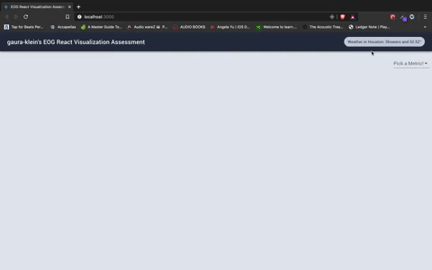

## Create React App Visualization

---
This assessment was bespoke handcrafted for gaura-klein.

---
# Takeaways

First things first this assessment was great! I had a lot of fun putting it together and it was a great opportunity to work with some technologies I haven't experimented with yet.

If I had the opportunity to go at this assessment again, I think i would try to eliminate the queries I am using. For visualizing current metric data I am using the getLastKnownMeasurement query to poll the latest data for each selected metric. When all 6 of the metrics are selected that is 6 queries every 1.3 seconds. I feel like that's a bit excessive and wouldn't scale well. 

For rendering the chart I am using the getMultipleMeasurements query and I feel like a good next step would be to eliminate the getLastKnownMeasurement query entirely and display both current and historical data from the getMultipleMeasurements query.

One thing I wish I had explored a little more deeply was subscriptions and if I could revisit this feature I would definitely invest some time into implementing them.

The highlight of the project for me was graphql and urql, I found the functionality and documentation of both to be excellent. 

---

Read more about this assessment [here](https://react.eogresources.com)

